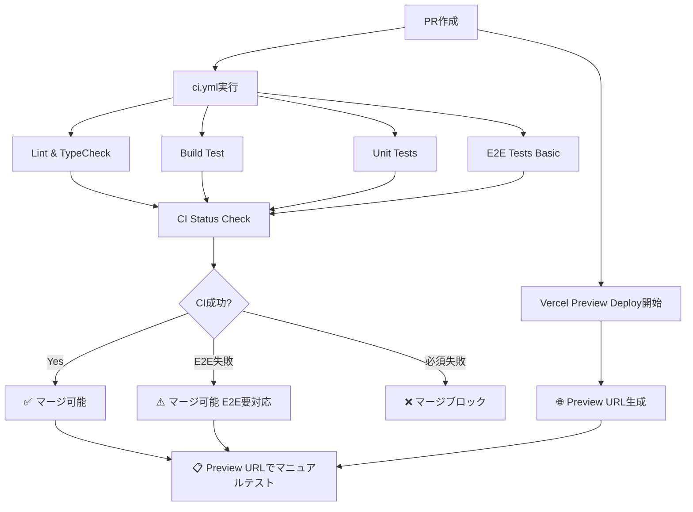
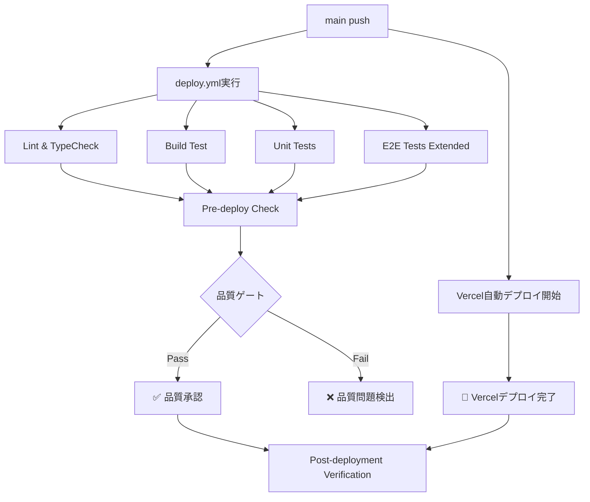

# GitHub Actions Workflows

このディレクトリには、Usakaプロジェクトの CI/CD パイプライン設定が含まれています。

## ワークフロー構成

### 📋 `ci.yml` - Pull Request Checks

**トリガー**: Pull Request → main ブランチ
**目的**: PR品質チェック + Vercel Preview連携

**ジョブ**:

- `lint-and-typecheck`: ESLint + TypeScript 型チェック
- `build-test`: ビルドテスト
- `unit-tests`: ユニットテスト
- `e2e-tests`: 基本的なE2Eテスト (1つのブラウザ)
- `ci-status`: 総合判定 (ブランチ保護ルール用)
- `preview-verification`: Vercel Preview URLの案内

**ポリシー**:

- 必須: Lint、TypeCheck、Build、Unit Tests
- オプション: E2E Tests (失敗してもマージ可能)
- Vercel Preview: 自動生成、マニュアルテスト推奨

### 🚀 `deploy.yml` - Production Quality Gate

**トリガー**: Push → main ブランチ
**目的**: 本番品質ゲート (Vercel自動デプロイ前の品質チェック)

**ジョブ**:

- `lint-and-typecheck`: ESLint + TypeScript 型チェック
- `build-test`: ビルドテスト
- `unit-tests`: ユニットテスト
- `e2e-tests`: 包括的なE2Eテスト (全ブラウザ)
- `pre-deploy-check`: 品質ゲート検証
- `quality-gate`: 品質ゲート結果サマリー
- `post-deployment-verification`: Vercelデプロイ後の検証

**ポリシー**:

- 必須: Lint、TypeCheck、Build、Unit Tests
- E2E失敗でも品質ゲート通過 (警告付き)
- Vercelが実際のデプロイを自動実行

### 🔧 `shared-steps.yml` - Reusable Workflow

**目的**: 共通処理の再利用
**含まれる処理**:

- 依存関係のセットアップ・キャッシュ
- Lint実行
- 型チェック実行
- ビルド実行
- ユニットテスト実行

## ワークフロー実行例

### Pull Request時



### メインブランチプッシュ時



## ブランチ保護設定

GitHubのブランチ保護ルールで以下を設定:

```yaml
# 必須チェック (ci.yml)
required_status_checks:
  - 'CI Status Check'

# 推奨設定
settings:
  - require_pull_request_reviews: true
  - dismiss_stale_reviews: true
  - require_code_owner_reviews: false
  - required_approving_review_count: 1
```

## 環境変数・シークレット

### 必要なシークレット

- `NEXT_PUBLIC_SUPABASE_URL`: Supabase プロジェクトURL
- `NEXT_PUBLIC_SUPABASE_ANON_KEY`: Supabase 匿名キー

## カスタマイズ

### E2Eテスト範囲の調整

```yaml
# PR用 (軽量)
- name: Run basic E2E test
  run: npx playwright test e2e/auth/basic-auth.spec.ts --project=chromium

# Deploy用 (包括的)
- name: Run comprehensive E2E tests
  run: npx playwright test --reporter=line
```

### ヘルスチェックの追加

`deploy.yml`の`post-deploy-check`ジョブで:

```bash
curl -f https://your-app.vercel.app/api/health
```

## トラブルシューティング

### よくある問題

1. **E2Eテスト失敗**

   - PR: マージ可能だが、修正推奨
   - Deploy: デプロイ継続、監視要

2. **ビルド失敗**

   - 環境変数の確認
   - 依存関係の更新確認

3. **キャッシュ問題**
   - Node.js バージョン変更時は手動クリア
   - Actions画面でキャッシュ削除

### パフォーマンス最適化

- 依存関係キャッシュ活用
- Playwright バイナリキャッシュ
- 並列実行でテスト時間短縮

## 更新履歴

- 2025-01-01: ワークフロー分離 (ci.yml, deploy.yml)
- 2025-01-01: 再利用可能ワークフロー追加 (shared-steps.yml)
