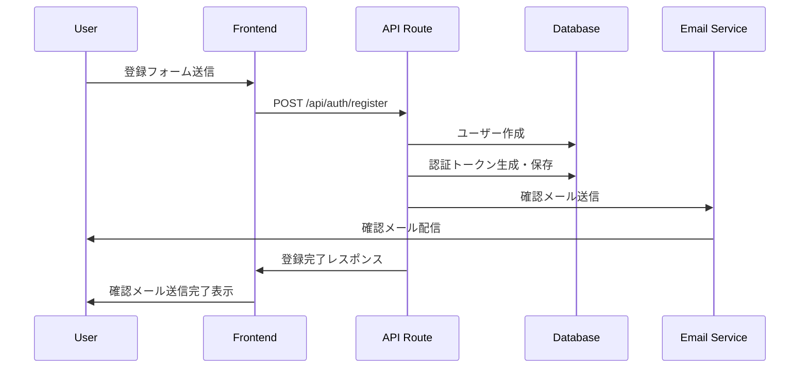
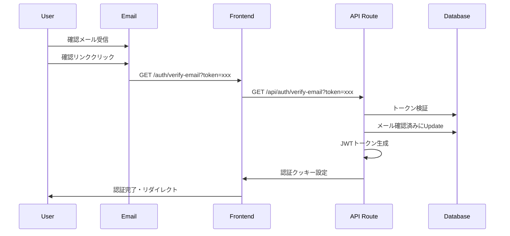

# メール認証システム設計書

## 概要

Usakaアプリケーションでは、ユーザーのメールアドレス認証機能を実装しています。本番環境ではResend、開発環境ではMailHogを使用したハイブリッド構成となっています。

## アーキテクチャ

### 全体構成

```
┌─────────────────┐    ┌──────────────────┐    ┌─────────────────┐
│   User Email    │◄───│   Email Service  │◄───│   Next.js App   │
│   Client        │    │                  │    │   API Routes    │
└─────────────────┘    └──────────────────┘    └─────────────────┘
                                │                         │
                                ▼                         ▼
                       ┌─────────────────┐    ┌─────────────────┐
                       │   本番: Resend  │    │   PostgreSQL    │
                       │ 開発: MailHog   │    │   (Supabase)    │
                       └─────────────────┘    └─────────────────┘
```

### 技術スタック

#### 本番環境
- **メール送信**: Resend API
- **認証フロー**: JWT + メール認証
- **データベース**: Supabase PostgreSQL

#### 開発環境
- **メール送信**: MailHog (Docker)
- **認証フロー**: JWT + メール認証
- **データベース**: Supabase Local (Docker)

## メール認証フロー

### 1. ユーザー登録フロー



### 2. メール確認フロー



## データベース設計

### メール認証関連フィールド

```sql
-- Users テーブルに追加されたフィールド
ALTER TABLE users ADD COLUMN email_verified BOOLEAN DEFAULT false;
ALTER TABLE users ADD COLUMN email_verification_token VARCHAR(255);
ALTER TABLE users ADD COLUMN email_verification_expiry TIMESTAMP WITH TIME ZONE;

-- インデックス
CREATE INDEX idx_users_email_verified ON users(email_verified);
CREATE INDEX idx_users_verification_token ON users(email_verification_token);
```

### トークン仕様

- **生成方法**: `crypto.randomBytes(32).toString('hex')`
- **有効期限**: 24時間
- **一意性**: ユーザーごとに一意
- **セキュリティ**: URLセーフな64文字のランダム文字列

## API エンドポイント

### 1. ユーザー登録 (`POST /api/auth/register`)

**リクエスト**:
```typescript
{
  userName: string
  email: string
  password: string
  displayName?: string
  skinType?: 'normal' | 'dry' | 'oily' | 'combination' | 'sensitive'
}
```

**レスポンス**:
```typescript
{
  user: {
    id: string
    userName: string
    email: string
    emailVerified: false
    // ...
  }
  message: "ユーザー登録が完了しました。確認メールをお送りしましたので、メールアドレスの確認を行ってください。"
}
```

**処理フロー**:
1. バリデーション実行
2. ユーザー作成
3. 認証トークン生成・保存
4. 確認メール送信
5. レスポンス返却（認証クッキーは設定しない）

### 2. メール確認 (`GET /api/auth/verify-email`)

**パラメータ**:
- `token`: 認証トークン

**レスポンス**:
```typescript
{
  message: "メールアドレスの確認が完了しました"
  user: {
    id: string
    userName: string
    email: string
    emailVerified: true
    // ...
  }
}
```

**処理フロー**:
1. トークンの検証（存在・有効期限）
2. ユーザーの`emailVerified`をtrueに更新
3. トークン関連フィールドをクリア
4. JWTトークン生成
5. 認証クッキー設定
6. レスポンス返却

### 3. 確認メール再送信 (`POST /api/auth/resend-verification`)

**リクエスト**:
```typescript
{
  email: string
}
```

**レスポンス**:
```typescript
{
  message: "確認メールを再送信しました"
}
```

## メール送信システム

### 環境別設定

#### 本番環境 (Resend)
```typescript
// NODE_ENV=production && RESEND_API_KEY存在時
const resend = new Resend(process.env.RESEND_API_KEY)
await resend.emails.send({
  from: 'noreply@yourdomain.com',
  to: userEmail,
  subject: '【化粧品体験共有サービス】メールアドレスの確認',
  html: htmlContent,
  text: textContent
})
```

#### 開発環境 (MailHog)
```typescript
// NODE_ENV=development || RESEND_API_KEY未設定時
const mailhogTransporter = createTransport({
  host: 'localhost',
  port: 1025,
  secure: false,
  auth: false
})
await mailhogTransporter.sendMail({
  from: 'noreply@yourdomain.com',
  to: userEmail,
  subject: '【化粧品体験共有サービス】メールアドレスの確認',
  html: htmlContent,
  text: textContent
})
```

### メールテンプレート

#### HTML版
```html
<!DOCTYPE html>
<html>
<head>
  <meta charset="utf-8">
  <title>メールアドレスの確認</title>
</head>
<body style="font-family: Arial, sans-serif; line-height: 1.6; color: #333;">
  <div style="max-width: 600px; margin: 0 auto; padding: 20px;">
    <h2 style="color: #2c3e50;">化粧品体験共有サービス</h2>
    <h3>メールアドレスの確認</h3>
    
    <p>こんにちは、{{userName}}さん</p>
    
    <p>アカウント登録ありがとうございます。<br>
    以下のリンクをクリックして、メールアドレスの確認を完了してください。</p>
    
    <div style="text-align: center; margin: 30px 0;">
      <a href="{{verificationUrl}}" 
         style="background-color: #3498db; color: white; padding: 12px 30px; 
                text-decoration: none; border-radius: 5px; display: inline-block;">
        メールアドレスを確認する
      </a>
    </div>
    
    <p style="color: #666; font-size: 14px;">
      このリンクは24時間有効です。<br>
      もしこのメールに心当たりがない場合は、このメールを無視してください。
    </p>
  </div>
</body>
</html>
```

#### テキスト版
```text
化粧品体験共有サービス

メールアドレスの確認

こんにちは、{{userName}}さん

アカウント登録ありがとうございます。
以下のURLにアクセスして、メールアドレスの確認を完了してください。

{{verificationUrl}}

このリンクは24時間有効です。
もしこのメールに心当たりがない場合は、このメールを無視してください。

---
このメールは自動送信されています。返信はできません。
```

## 開発環境セットアップ

### MailHog セットアップ

1. **Docker Compose起動**:
```bash
npm run mailhog:start
```

2. **管理画面アクセス**:
- URL: http://localhost:8025
- SMTP: localhost:1025

3. **メール送信テスト**:
```bash
# ユーザー登録
curl -X POST http://localhost:3000/api/auth/register \
  -H "Content-Type: application/json" \
  -d '{
    "userName": "testuser",
    "email": "test@example.com",
    "password": "password123"
  }'

# MailHogでメール確認
open http://localhost:8025
```

### 開発用コマンド

```bash
# 開発環境一括起動
npm run dev:full

# MailHog単体操作
npm run mailhog:start
npm run mailhog:stop

# Supabase操作
supabase start
supabase stop
supabase status
```

## セキュリティ考慮事項

### トークンセキュリティ

1. **エントロピー**: 256ビットのランダム性
2. **有効期限**: 24時間で自動失効
3. **一回限り**: 使用後は即座に無効化
4. **推測困難性**: URLセーフな64文字

### メール送信セキュリティ

1. **送信者認証**: SPF/DKIM/DMARC設定
2. **フィッシング対策**: 正規ドメインからの送信
3. **情報漏洩防止**: 最小限の情報のみメール記載
4. **リンク検証**: 署名付きURL（将来実装）

### レート制限

```typescript
// 将来実装予定
const rateLimiter = {
  maxRequests: 3,     // 最大3回
  windowMs: 3600000,  // 1時間
  blockDurationMs: 3600000  // 1時間ブロック
}
```

## 監視・ログ

### メトリクス

- **送信成功率**: 99%以上維持
- **配信時間**: 1分以内
- **トークン利用率**: 80%以上
- **エラー率**: 1%未満

### ログ出力

```typescript
// 成功ログ
console.log(`📧 Email sent to ${isDevelopment ? 'MailHog' : 'Resend'}: ${to}`)

// エラーログ
console.error('Email send error:', {
  service: isDevelopment ? 'MailHog' : 'Resend',
  to: email,
  error: error.message
})
```

## トラブルシューティング

### よくある問題

#### 1. メールが届かない
- **原因**: SMTP設定ミス、スパムフィルタ
- **対処**: MailHog管理画面で確認、設定見直し

#### 2. トークンが無効
- **原因**: 有効期限切れ、使用済み
- **対処**: 再送信機能利用

#### 3. 開発環境でメール送信失敗
- **原因**: MailHogが起動していない
- **対処**: `npm run mailhog:start`実行

### デバッグ方法

```bash
# メール送信ログ確認
docker logs usaka_mailhog

# データベース状態確認
npx prisma studio

# 認証トークン確認
SELECT email, email_verification_token, email_verification_expiry 
FROM users 
WHERE email = 'test@example.com';
```

## 今後の拡張予定

### Phase 2 機能

1. **パスワードリセット**: メール経由でのパスワード変更
2. **メールアドレス変更**: 新旧アドレス両方での確認
3. **通知設定**: メール通知のON/OFF設定
4. **テンプレート**: 多様なメールテンプレート

### Phase 3 機能

1. **マルチ言語**: 国際化対応
2. **リアルタイム**: WebSocket経由の即座通知
3. **分析**: メール開封率、クリック率追跡
4. **セキュリティ**: 2FA対応